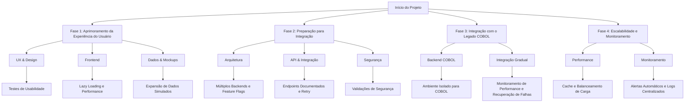

🚀 Transformando Desafios em Soluções: A Jornada de Evolução
📖 Nossa História Até Aqui
O caminho de transformação começa ao reconhecer as dores que nossos usuários enfrentam todos os dias. Sabemos que sistemas antigos, que muitas vezes parecem intransponíveis, ainda são vitais para muitas operações. Mas, mais do que nunca, é essencial modernizar e humanizar a interação com esses sistemas. Para isso, nossa missão é criar uma experiência intuitiva, funcional e livre de frustrações enquanto preservamos a confiabilidade que as infraestruturas legadas oferecem.

Começamos com o foco em criar interfaces modernas e fluidas que atendem as necessidades dos usuários, oferecendo respostas rápidas e precisas. Agora, estamos prontos para integrar a engine de COBOL de forma que a transição seja transparente, sem sacrificar a experiência de uso.

🎯 Nossa Evolução: Como Resolvemos Suas Dores

# Diagrama de Evolução do Projeto

## 🚀 Fases da Evolução

# 🚀 Transformando Desafios em Soluções: A Evolução Que Alivia as Dores da TI

## 📖 Nossa História Até Aqui

Nos departamentos de TI, a principal dor é lidar com **sistemas legados** que, embora confiáveis, são complexos, difíceis de manter e dispendiosos de atualizar. Sabemos que essa sobrecarga não só consome tempo e recursos, mas também impede a inovação. Por isso, nossa missão é criar uma solução que **simplifique a integração** entre o legado e as novas tecnologias, garantindo uma operação mais eficiente e sem falhas.

Nosso foco foi oferecer uma experiência simples tanto para o usuário quanto para os profissionais de TI, priorizando **facilidade de manutenção**, **segurança** e **performance**. Com uma interface moderna, fluida e fácil de gerenciar, estamos prontos para dar o próximo passo: **integrar a engine COBOL** sem comprometer a confiabilidade e a segurança exigidas pelos departamentos de TI.

---

## 🎯 Nossa Evolução: Aliviando as Dores do Departamento de TI

### Fase 1: Aprimoramento da Experiência do Usuário

**"Transformando complexidade em simplicidade, para que TI se concentre no que realmente importa."**

#### UX & Design

- **Dor**: A complexidade das interfaces antigas gera confusão e dificulta o treinamento e a adoção pelos funcionários.
  - **Solução**: Realizamos testes de usabilidade para criar interfaces intuitivas, reduzindo o tempo de treinamento e aumentando a produtividade.

- **Dor**: Falta de feedback imediato e transparência nas ações do sistema.
  - **Solução**: Implementamos feedback visual em tempo real, para que os administradores e usuários vejam as mudanças de forma clara e instantânea, sem a necessidade de investigar logs.

- **Dor**: Interfaces não responsivas dificultam a operação em múltiplos dispositivos.
  - **Solução**: Criamos uma interface **mobile-first**, para que a TI possa monitorar e interagir com o sistema de qualquer lugar, em qualquer dispositivo.

#### Frontend

- **Dor**: Desempenho lento nas aplicações afeta tanto a experiência do usuário quanto a eficiência da TI, que precisa gastar tempo com manutenção de sistemas lentos.
  - **Solução**: Implementamos **lazy loading** para melhorar a performance e otimizar o uso dos recursos, garantindo uma operação mais eficiente.

- **Dor**: Erros inesperados e dificuldades de diagnóstico sobre o que causou falhas no sistema.
  - **Solução**: Criamos componentes de tratamento de erros e ferramentas de monitoramento em tempo real, para que os times de TI possam diagnosticar problemas rapidamente e com precisão.

#### Dados & Mockups

- **Dor**: A falta de dados reais ou consistentes durante o desenvolvimento cria incertezas e retrabalho.
  - **Solução**: Expandimos os dados simulados para cobrir cenários reais, garantindo que o time de TI possa testar todas as possíveis condições de operação sem surpresas.

---

### Fase 2: Preparação para Integração

**"Conectando o legado com as novas tecnologias, sem comprometer a segurança ou performance."**

#### Arquitetura

- **Dor**: Sistemas legados e modernos não se comunicam bem e são difíceis de integrar sem comprometer a confiabilidade.
  - **Solução**: Criamos uma arquitetura **modular e multi-backend**, permitindo a integração tranquila entre diferentes sistemas e tecnologias sem causar downtime ou riscos de falhas.

- **Dor**: Mudanças de configuração frequentemente resultam em erros e atrasos nos ambientes de produção.
  - **Solução**: Implementamos ambientes separados e scripts de monitoramento para facilitar a implementação e garantir a estabilidade em qualquer cenário.

#### API & Integração

- **Dor**: A complexidade das integrações entre diferentes sistemas dificulta a implementação e manutenção, gerando atrasos.
  - **Solução**: Criamos **endpoints simples e bem documentados**, permitindo que a TI integre de forma rápida e segura com sistemas legados e modernos, com suporte a mecanismos de retry e fallback para lidar com falhas temporárias.

#### Segurança

- **Dor**: Vulnerabilidades de segurança em sistemas legados colocam dados sensíveis em risco e exigem constante atenção.
  - **Solução**: Adicionamos **validações de segurança avançadas**, como rate limiting e headers de segurança, para que o time de TI tenha mais confiança na proteção dos dados e na integridade do sistema.

---

### Fase 3: Integração com o Legado COBOL

**"Inovando sem perder a confiabilidade, e garantindo uma transição suave para o time de TI."**

#### Backend COBOL

- **Dor**: Ambientes de COBOL são difíceis de configurar e monitorar, exigindo know-how especializado e com alto custo de manutenção.
  - **Solução**: Criamos um **ambiente isolado e simplificado** para COBOL, reduzindo a complexidade da configuração e manutenção do backend, e permitindo que o time de TI se concentre em outras tarefas de maior impacto.

- **Dor**: Sistemas antigos exigem tratamento manual e demorado, o que aumenta a carga de trabalho do time de TI.
  - **Solução**: Desenvolvemos **comandos automatizados** e logs estruturados, para que o time de TI consiga monitorar e resolver problemas rapidamente sem precisar de intervenções manuais frequentes.

#### Integração

- **Dor**: A integração gradual com sistemas legados pode resultar em falhas inesperadas e atrasos no cronograma.
  - **Solução**: A **integração incremental** por feature permite que a TI realize testes e ajustes ao longo do caminho, sem interrupções inesperadas ou impactos no desempenho.

---

### Fase 4: Escalabilidade e Monitoramento

**"Crescendo sem sobrecarregar os recursos de TI, com controle total e visibilidade."**

#### Performance

- **Dor**: A sobrecarga de consultas lentas e altos volumes de dados pode prejudicar tanto a experiência do usuário quanto a performance do sistema.
  - **Solução**: Implementamos estratégias de **caching**, balanceamento de carga e otimização de queries COBOL para garantir alta performance sem aumentar a carga no time de TI.

#### Monitoramento

- **Dor**: A falta de monitoramento eficaz torna difícil para TI detectar falhas e lidar com incidentes rapidamente.
  - **Solução**: Criamos **alertas automáticos** e **logging centralizado**, para que o time de TI tenha visibilidade total e consiga agir de forma proativa antes que um problema se torne um incidente.

---

## 📋 Guias de Referência

- **README.md** - Visão geral do projeto
- **GUIDE-UX.md** - Diretrizes de experiência do usuário
- **GUIDE-CLIENT.md** - Documentação do frontend
- **GUIDE-API.md** - Documentação da API
- **GUIDE-RULES.md** - Regras de negócio

---

## 📝 TODOs por Seção

### Backend (TODO-BACK.md)
- Documentação completa das APIs
- Implementação de JWT e autenticação avançada
- Sistema de filas para processamento COBOL
- Testes automatizados e ambiente de staging

### COBOL Server (TODO-COBOL-SERVER.md)
- Robustez do processo (reconexão, timeout, retry)
- Tratamento de erros estruturado
- Monitoramento básico do processo COBOL
- Melhorias futuras (escala, balanceamento, CI/CD)

### Frontend (GUIDE-CLIENT.md)
- Estrutura base de serviços e componentes
- Implementação com dados mock
- Integração com API real
- Validação e tratamento de erros

### UX (GUIDE-UX.md)
- Estrutura base (sidebar, login, dashboard)
- Operações básicas (transferências, saldo, extrato)
- Melhorias (PIX, comprovantes, filtros)
- Recursos adicionais (agendamentos, favoritos)

Para detalhes completos de cada seção, consulte os respectivos arquivos de referência.

---

## 🤝 Contribuindo

Cada tarefa neste TODO representa um passo para aliviar a carga de trabalho do time de TI e melhorar a operação como um todo. Ao trabalhar em uma tarefa, lembre-se de:

- Verificar as dependências nos guias relacionados.
- Manter o foco na eficiência e na segurança.
- Documentar decisões importantes.
- Atualizar os guias relevantes.

---

## 📊 Progresso

- **Fase 1**: 🟢 Concluída
- **Fase 2**: 🟢 Concluída
- **Fase 3**: 🟡 Em andamento
- **Fase 4**: ⚪ Planejada
